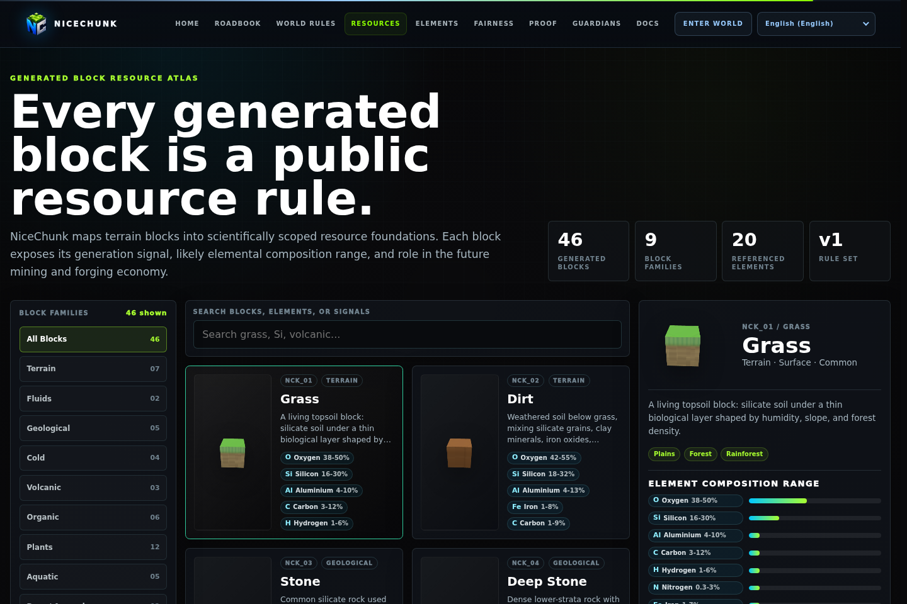
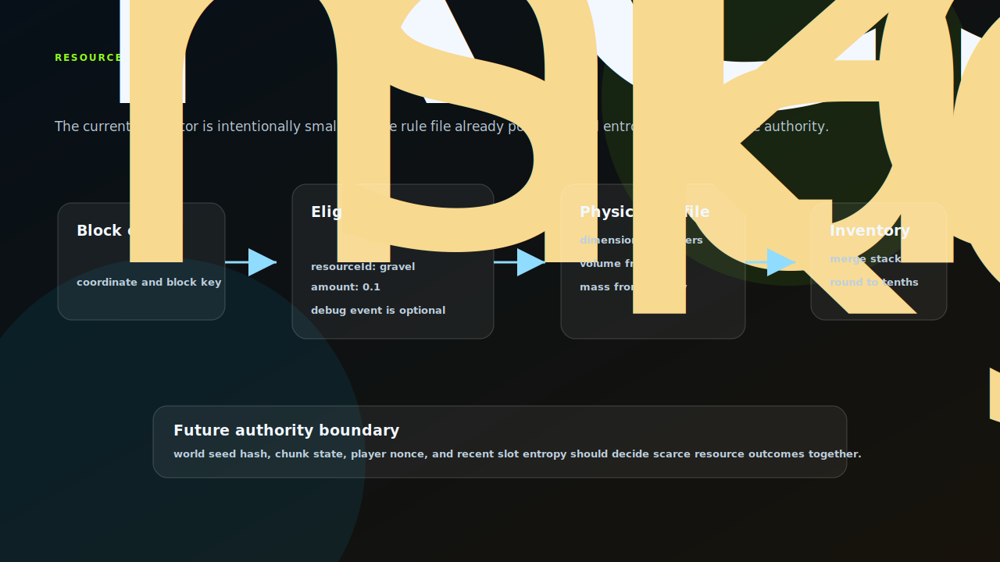

# NiceChunk Resource Rule

Resource rule reference, simulator, and block-resource mapping.

## Project Overview

This repository contains the resource rule reference for NiceChunk. It describes how world blocks, rarity, mass, and source categories connect into a resource system.

The project includes the public resource rule JSON, block atlas data, resource simulator logic, and a browser page for inspecting rule behavior.

It is separated because resources are a design and economy surface. They should be reviewed and evolved independently from world rendering or contract deployment.

## Discovery Gate

The current simulator is intentionally narrow: stone can yield a small amount of gravel, the result is rounded, and matching hotbar stacks are updated in place. That small rule is useful because it makes the intended authority boundary easy to see.

Resource discovery should not become a table that can be fully precomputed from the public terrain seed. The rule file already documents the future entropy inputs: world seed hash, chunk coordinate, local coordinate, chunk state hash, player nonce, and recent slot entropy. Those inputs let common resources stay explainable while scarce resources remain harder to farm deterministically before play occurs.

The physical helpers are kept separate from discovery. Volume and mass are derived from dimensions and density, which makes downstream backpack, marketplace, and crafting rules easier to audit.

## System Principles

- Rules should be data-first: resource definitions live in explicit JSON and catalog modules rather than being scattered across UI code.
- Mass and rarity must be inspectable: player-facing economy decisions need transparent inputs.
- World links are explicit: resource rules connect to generated blocks and block atlas entries instead of free-floating item names.
- Simulation should support balancing: developers need a quick way to inspect category and rarity effects.

## How It Works

- Edit resource rules in the configuration file, then inspect the browser page for visible output.
- Use resource simulator modules to test how block sources map to collectible resources.
- Keep mass logic synchronized with backpack and marketplace behavior in the main client.
- Update locale dictionaries for all visible labels after changing rule categories.

## Why This Project Matters

Resources are where world exploration becomes economy. This repository makes those rules public, reviewable, and forkable.

A standalone resource rule project helps future balancing work happen without requiring changes to contract code or rendering systems.

## Repository Layout

- `resource_rule/`
- `config/resource_rules_v1.json`
- `src/resourceSimulator.js`
- `src/physics/`

## Development Workflow

1. Clone the repository and inspect the focused source tree before changing shared contracts or generated artifacts.
2. Keep changes scoped to the domain of this repository. Cross-domain changes should be coordinated through the matching split repositories.
3. Run the smallest meaningful validation for the touched surface: build checks for programs, browser checks for pages, or fixture checks for deterministic libraries.
4. Update screenshots and documentation when behavior, visible UI, public constants, or developer-facing workflows change.

## Future Development Direction

- Add deterministic sampling tools that show expected resource distribution by biome and depth.
- Introduce rule versioning and compatibility hashes for chain configuration.
- Add export formats for analytics and balancing notebooks.
- Connect directly to marketplace category rules once the market program stabilizes.

## Maintenance Notes

This repository is a focused split from the main NiceChunk working tree. Keep the public surface explicit: avoid committing private keys, wallet files, deployment-only scripts, machine-specific configuration, or generated build artifacts. Runtime user-facing copy should stay behind the i18n layer where the project has an i18n surface.
